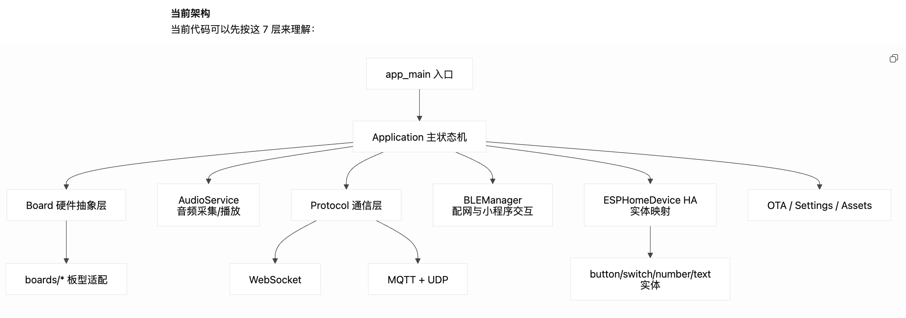

# Houzzkit 项目接手梳理

## 1. 文档目的

这份文档用于帮助新接手 `houzzkit-ai` 项目的开发者快速建立全局认知，重点包括：

- 当前项目的整体架构
- 关键模块及职责划分
- 从首次提交到当前版本的主要功能演进
- 接手时建议优先关注的模块和风险点

本文基于仓库当前代码和 Git 历史整理，适合作为接手、汇报和后续深入阅读的入口材料。

## 2. 项目定位

`houzzkit-ai` 是一个面向 Home Assistant 的 AI 智能音箱固件项目，运行于 `ESP32` 系列芯片之上，整体基于 `ESP-IDF`，并集成了 `ESPHome` 能力。

从仓库内容看，这个项目不是以 `Go/Python` 为主的后端项目，而是一个以 `C++` 为主的嵌入式固件仓库。`Python` 在这里主要承担构建、打包、资源处理等辅助作用。

项目在原始智能音箱底座的基础上，逐步强化了以下能力：

- Home Assistant 实体接入
- BLE 配网与小程序交互
- 文本实体触发的语音播放和命令执行
- 睡眠模式和产品化配置能力
- MQTT 协议与 UDP 音频通道
- 新硬件板型适配与内存优化

## 3. 当前架构总览

### 3.1 分层理解

可以先把项目理解成以下几层：

1. 入口层：设备启动与应用初始化
2. 应用调度层：主状态机、事件循环、设备状态管理
3. 硬件抽象层：屏幕、音频、网络、背光、摄像头等板级适配
4. 设备能力映射层：通过 ESPHome 暴露给 Home Assistant 的实体
5. 配网与本地交互层：BLE 配网、设备属性同步、小程序交互
6. 通信协议层：WebSocket、MQTT、UDP 音频传输
7. 支撑能力层：设置持久化、OTA、资源文件、构建和打包

### 3.2 架构图

## 4. 关键目录与模块

### 4.1 主入口与总调度

- [`houzzkit-ai/main/main.cc`](houzzkit-ai/main/main.cc)
- [`houzzkit-ai/main/application.h`](houzzkit-ai/main/application.h)
- [`houzzkit-ai/main/application.cc`](houzzkit-ai/main/application.cc)

职责说明：

- `main.cc` 是固件入口，负责启动默认事件循环，并拉起 `Application`
- `Application` 是整个项目的总调度中心
- 设备状态切换、音频流程、协议连接、升级、任务调度都汇总在这里

接手时建议：

- 优先读懂 `Application::Start()`
- 梳理 `DeviceState` 的流转
- 关注主动发声、开始监听、停止监听、OTA、错误处理等主流程

### 4.2 板级抽象与硬件适配

- [`houzzkit-ai/main/boards/common/board.h`](houzzkit-ai/main/boards/common/board.h)
- [`houzzkit-ai/main/CMakeLists.txt`](houzzkit-ai/main/CMakeLists.txt)
- [`houzzkit-ai/main/boards`](houzzkit-ai/main/boards)

职责说明：

- `Board` 抽象了不同板型下的音频、显示、网络、背光等差异
- `main/CMakeLists.txt` 根据 `CONFIG_BOARD_TYPE_*` 选择对应板型实现
- `main/boards/*` 中每个目录基本对应一个硬件设备

接手时建议：

- 尽快确认团队当前主用板型
- 不要一开始就把所有板型都看一遍
- 优先关注当前正在使用或最近新增的板型

### 4.3 ESPHome 与 Home Assistant 映射

- [`houzzkit-ai/main/esphome/esphome_device.h`](houzzkit-ai/main/esphome/esphome_device.h)
- [`houzzkit-ai/main/esphome/esphome_device.cc`](houzzkit-ai/main/esphome/esphome_device.cc)
- [`houzzkit-ai/components/esphome`](houzzkit-ai/components/esphome)

职责说明：

- 通过 `ESPHomeDevice` 将设备能力映射为 HA 可见实体
- 当前已注册的实体类型包括：
  - `button`
  - `switch`
  - `number`
  - `text`
- 这里承载了很多“产品化配置项”，例如：
  - 麦克风开关
  - 音量
  - 连续对话
  - 空闲息屏
  - 文本播放语音
  - 执行命令
  - 询问后执行命令
  - 睡眠模式

接手时建议：

- 重点理解 `setPlayVoiceText`、`setExecuteCommandText`、`setAskAndExecuteCommandText`
- 理解设置变更如何写入 `Settings`
- 理解 BLE 与 ESPHome 两边如何同步状态

### 4.4 BLE 配网与本地交互

- [`houzzkit-ai/main/ble/ble_manager.h`](houzzkit-ai/main/ble/ble_manager.h)
- [`houzzkit-ai/main/ble`](houzzkit-ai/main/ble)
- [`houzzkit-ai/components/esp-wifi-connect`](houzzkit-ai/components/esp-wifi-connect)

职责说明：

- 通过 BLE 与微信小程序或其他客户端交互
- 支持 Wi-Fi 配网
- 支持设备属性下发和状态回推
- 睡眠模式、音量、麦克风等能力也会通过 BLE 对外同步

接手时建议：

- 重点看配网流程和属性通知逻辑
- 重点确认 BLE 和 ESPHome 是否存在重复配置入口
- 后续排查“设置同步不一致”问题时，这里通常是重点区域

### 4.5 通信协议层

- [`houzzkit-ai/main/protocols/protocol.h`](houzzkit-ai/main/protocols/protocol.h)
- [`houzzkit-ai/main/protocols/websocket_protocol.cc`](houzzkit-ai/main/protocols/websocket_protocol.cc)
- [`houzzkit-ai/main/protocols/mqtt_protocol.h`](houzzkit-ai/main/protocols/mqtt_protocol.h)
- [`houzzkit-ai/main/protocols/mqtt_protocol.cc`](houzzkit-ai/main/protocols/mqtt_protocol.cc)

职责说明：

- `Protocol` 是协议抽象基类
- 设备与服务端的控制消息、会话消息、主动发声命令都从这里经过
- 当前已经存在至少两套链路：
  - `WebSocket`
  - `MQTT + UDP`

接手时建议：

- 搞清楚两套协议分别负责什么
- 分清控制消息与音频数据的承载方式
- 重点关注 MQTT 场景下的主动发声、UDP 丢包恢复、AEC 标识同步

### 4.6 睡眠模式与配置持久化

- [`houzzkit-ai/main/esphome/sleep_mode_time_interval.h`](houzzkit-ai/main/esphome/sleep_mode_time_interval.h)
- [`houzzkit-ai/main/esphome/sleep_mode_time_interval.cc`](houzzkit-ai/main/esphome/sleep_mode_time_interval.cc)
- [`houzzkit-ai/main/settings.h`](houzzkit-ai/main/settings.h)
- [`houzzkit-ai/main/settings.cc`](houzzkit-ai/main/settings.cc)

职责说明：

- `Settings` 负责配置持久化
- 睡眠模式属于较明显的中后期产品化功能
- 睡眠模式会影响音量策略和设备行为

接手时建议：

- 睡眠时间区间的判断逻辑需要重点验证
- 所有“设置项改动后立即生效”的行为都建议串起来看

### 4.7 OTA、资源与脚本

- [`houzzkit-ai/main/ota.cc`](houzzkit-ai/main/ota.cc)
- [`houzzkit-ai/main/assets.cc`](houzzkit-ai/main/assets.cc)
- [`houzzkit-ai/scripts`](houzzkit-ai/scripts)

职责说明：

- OTA 负责固件版本检查和升级
- Assets 负责资源文件应用
- `scripts` 中包含打包、发布和资源处理辅助逻辑

接手时建议：

- 如果当前目标是快速参与交付，先把打包和升级链路搞清楚
- `Python` 背景在这里更容易快速形成贡献

## 5. Git 历史演进总结

### 5.1 时间范围

当前仓库从首次提交到当前版本的主线时间范围如下：

- 首次提交：`2025-10-17`
- 当前最新提交：`2026-02-11`

主线版本目前已更新到：

- `2.1.2`

### 5.2 总体判断

从 Git 历史看，这个项目的演进重点并不是推翻底层架构，而是在已有智能音箱底座上，持续叠加 Home Assistant 适配、产品化能力、通信能力和硬件适配能力。

最明显的演进热点集中在以下区域：

- `main/application.cc`
- `main/esphome/esphome_device.cc`
- `main/ble/ble_manager.cc`
- `main/protocols/*`
- `main/esphome/sleep_mode_time_interval.*`
- `main/boards/esp32-s3-touch-lcd-1.85c-v2/*`
- `components/esphome/esphome/components/text/*`

### 5.3 主要功能演进时间线

| 日期 | 提交 | 主要变化 | 重点影响模块 |
| --- | --- | --- | --- |
| 2025-10-17 | `3787cdc` | 项目初始化 | `main`、`components/esp-wifi-connect`、`components/esphome` |
| 2025-10-24 | `7b96a96` | 升级 `esp-sr` 以支持唤醒词“你好小瑞” | `main/idf_component.yml` |
| 2025-10-24 | `78b3baa` | 增加 HA `text` 实体支持，支持播放文字和执行命令文本入口 | `components/esphome/components/text`、`main/esphome/esphome_device.*` |
| 2025-10-24 | `008956c` | 完成播放文字和执行命令基本流程 | `main/application.*`、`main/protocols/*` |
| 2025-10-28 | `e456cf9` | 修改执行命令协议 | `main/protocols/protocol.cc` |
| 2025-10-28 | `74d2992` | 完成语音播放和文字执行指令调试 | `main/application.cc` |
| 2025-10-28 | `68d1a94` | 优化配网时用户反馈机制 | `main/ble/ble_manager.cc` |
| 2025-10-30 | `b41d8b3` | 连续对话默认开启 | `main/esphome/esphome_device.h` |
| 2025-11-05 | `621ea00` | 实现“询问后执行”业务 | `main/application.*`、`main/esphome/esphome_device.*`、`main/protocols/*` |
| 2025-11-05 | `9791c3d` | 完成睡眠模式基本逻辑 | `main/esphome/*`、`main/ble/*`、`main/settings.*` |
| 2025-11-12 | `cc42670` | 调整睡眠模式区间判断逻辑 | `main/esphome/*` |
| 2025-11-27 | `40f6ca9` | 优化 WebSocket 场景音频播放，开启 MQTT 协议机制 | `main/application.*`、`main/audio/*`、`main/protocols/*` |
| 2025-11-27 | `1934ab0` | MQTT 协议调试完成 | `main/ble/*`、`main/protocols/*` |
| 2025-12-02 | `fc97321` | 打包机制增加更新包 bin 文件 | 打包流程 |
| 2026-02-02 | `47cfae8` | 修复 MQTT 场景主动发声无声音，优化 UDP 丢包卡顿，增加 AEC 标识上传 | `main/protocols/mqtt_protocol.*`、`main/protocols/websocket_protocol.cc` |
| 2026-02-11 | `f978dba` | 新增 `esp32-s3-touch-lcd-1.85c-v2` 板型并优化内存占用 | `main/boards/esp32-s3-touch-lcd-1.85c-v2/*`、`sdkconfig.defaults.esp32s3` |
| 2026-02-11 | `a991a62` | 版本更新到 `2.1.2` | `CMakeLists.txt` |

## 6. 接手时最应关注的变化主线

### 6.1 Home Assistant 控制能力增强

这是项目最关键的产品变化之一。

主要体现为：

- 增加 `text` 实体
- 支持从 HA 触发语音播放
- 支持从 HA 触发执行命令
- 支持“询问后执行”

接手时应重点确认：

- 这些能力是通过哪种协议发到服务端
- 文本实体输入后，调用链如何落到 `Application`
- 当前服务端协议是否仍与设备端实现保持一致

### 6.2 睡眠模式与用户配置体系

这是项目从“能跑”转向“可产品化”的典型标志。

主要体现为：

- 睡眠模式开关
- 睡眠时间区间
- 配置项持久化
- BLE 与 ESPHome 的双通道同步

接手时应重点确认：

- 睡眠模式是否只影响音量，还是也影响其他交互行为
- 睡眠时间跨天场景是否经过充分验证
- 配置项写入后是否存在状态不同步问题

### 6.3 通信协议从 WebSocket 走向多协议

从提交历史看，项目后期明显强化了 MQTT 能力。

主要体现为：

- 新增 MQTT 协议机制
- 与 UDP 音频通道结合
- 修复主动发声无声音
- 优化 UDP 丢包导致的卡顿
- 增加 AEC 状态上报

接手时应重点确认：

- 当前线上主用的协议是哪套
- WebSocket 是否仍是保底方案
- MQTT 和 UDP 结合后的排障手段是否已经沉淀

### 6.4 新硬件板型持续适配

项目后期增加了新的板型目录：

- [`houzzkit-ai/main/boards/esp32-s3-touch-lcd-1.85c-v2`](houzzkit-ai/main/boards/esp32-s3-touch-lcd-1.85c-v2)

接手时应重点确认：

- 当前量产或主测设备是否就是这一板型
- 最近的内存优化是否只针对该板型
- 板型切换是否会影响音频、显示、网络配置

## 7. 建议的阅读顺序

如果从零开始接手，建议按下面顺序阅读：

1. 先看项目说明和构建入口
   - [`houzzkit-ai/README.md`](houzzkit-ai/README.md)
   - [`houzzkit-ai/CMakeLists.txt`](houzzkit-ai/CMakeLists.txt)
   - [`houzzkit-ai/main/CMakeLists.txt`](houzzkit-ai/main/CMakeLists.txt)

2. 再看主流程
   - [`houzzkit-ai/main/main.cc`](houzzkit-ai/main/main.cc)
   - [`houzzkit-ai/main/application.h`](houzzkit-ai/main/application.h)
   - [`houzzkit-ai/main/application.cc`](houzzkit-ai/main/application.cc)

3. 再看 HA 与配置链路
   - [`houzzkit-ai/main/esphome/esphome_device.cc`](houzzkit-ai/main/esphome/esphome_device.cc)
   - [`houzzkit-ai/main/settings.cc`](houzzkit-ai/main/settings.cc)
   - [`houzzkit-ai/main/esphome/sleep_mode_time_interval.cc`](houzzkit-ai/main/esphome/sleep_mode_time_interval.cc)

4. 再看本地交互和协议
   - [`houzzkit-ai/main/ble/ble_manager.cc`](houzzkit-ai/main/ble/ble_manager.cc)
   - [`houzzkit-ai/main/protocols/protocol.cc`](houzzkit-ai/main/protocols/protocol.cc)
   - [`houzzkit-ai/main/protocols/mqtt_protocol.cc`](houzzkit-ai/main/protocols/mqtt_protocol.cc)
   - [`houzzkit-ai/main/protocols/websocket_protocol.cc`](houzzkit-ai/main/protocols/websocket_protocol.cc)

5. 最后看当前主板型
   - 当前实际使用的 `main/boards/<board>` 目录

## 8. 建议优先验证的事项

接手后建议尽快跑通以下验证闭环：

1. 本地能成功编译指定板型
2. 能烧录并看到串口日志
3. 能完成 BLE 配网
4. 能接入 Home Assistant
5. 能通过 HA 调整音量、麦克风、连续对话等设置
6. 能通过 HA 的文本实体触发语音播放和命令执行
7. 能确认当前使用的是 WebSocket 还是 MQTT 主链路
8. 能验证睡眠模式在跨天时间区间下行为正常
9. 能确认 OTA 和打包流程可用

## 9. 当前接手建议

基于目前代码和历史演进，接手优先级建议如下：

1. 先确认当前主用板型和主用协议
2. 先跑通完整设备链路，而不是先钻细节
3. 优先掌握 `Application`、`ESPHomeDevice`、`BLEManager`、`Protocol`
4. 把近期演进功能作为接手重点，而不是平均分配精力
5. 尽快整理一份自己的启动流程图和状态流转图

如果后续继续补充文档，建议新增以下主题：

- 当前主板型编译与烧录指南
- BLE 配网协议说明
- ESPHome 实体定义与 HA 联动清单
- WebSocket 与 MQTT 两套协议对比
- 睡眠模式与设置项清单
- OTA 与打包发布流程
