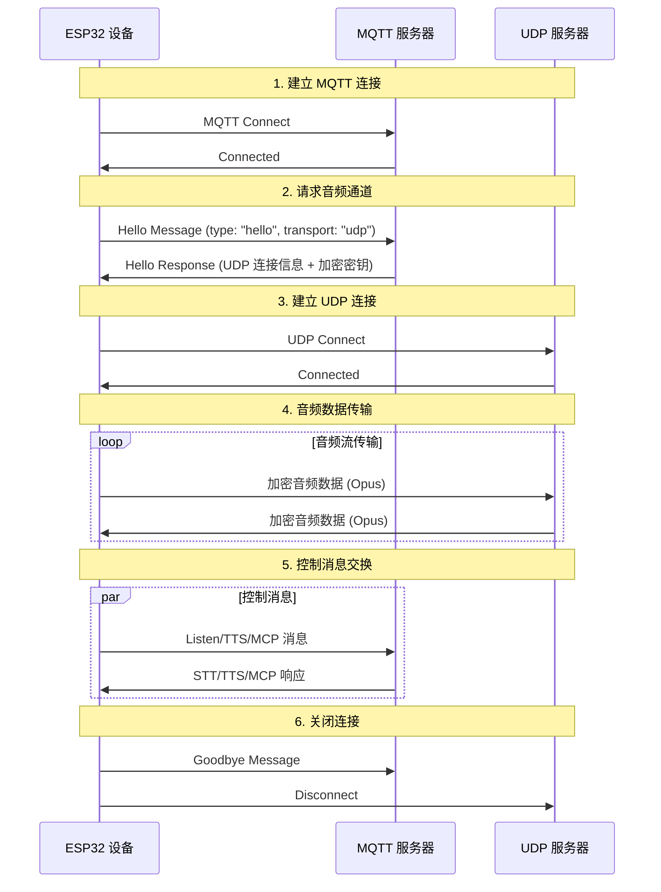
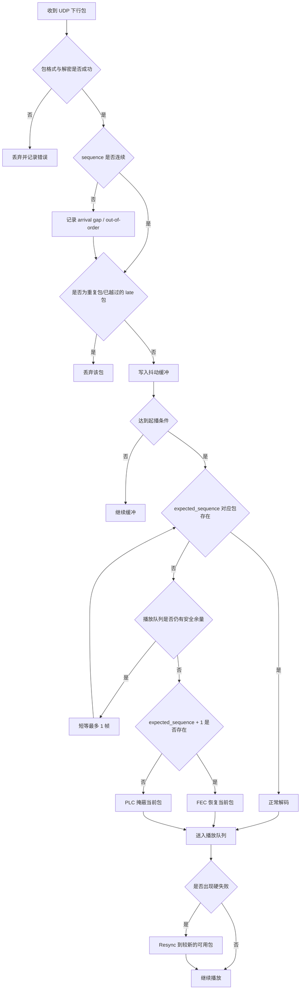
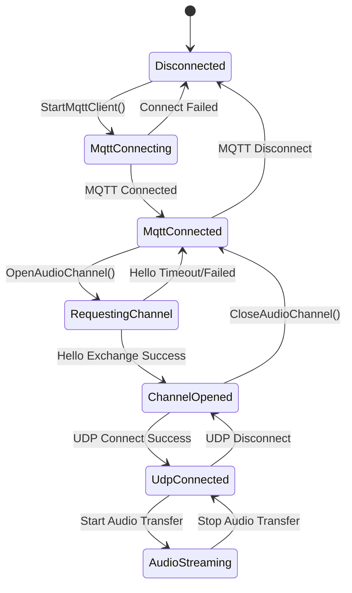

# MQTT + UDP 混合通信协议文档

基于代码实现整理的 MQTT + UDP 混合通信协议文档，概述设备端与服务器之间如何通过 MQTT 进行控制消息传输，通过 UDP 进行音频数据传输的交互方式。

---

## 1. 协议概览

本协议采用混合传输方式：
- **MQTT**：用于控制消息、状态同步、JSON 数据交换
- **UDP**：用于实时音频数据传输，支持加密

### 1.1 协议特点

- **双通道设计**：控制与数据分离，确保实时性
- **加密传输**：UDP 音频数据使用 AES-CTR 加密
- **序列号诊断**：用于下行乱序、迟到、重复包和恢复效果统计
- **下行自适应恢复**：设备端通过 jitter buffer、Opus FEC/PLC、短等待和极端弱网 resync 降低卡顿
- **自动重连**：MQTT 连接断开时自动重连

---

## 2. 总体流程概览



---

## 3. MQTT 控制通道

### 3.1 连接建立

设备通过 MQTT 连接到服务器，连接参数包括：
- **Endpoint**：MQTT 服务器地址和端口
- **Client ID**：设备唯一标识符
- **Username/Password**：认证凭据
- **Keep Alive**：心跳间隔（默认240秒）

### 3.2 Hello 消息交换

#### 3.2.1 设备端发送 Hello

```json
{
  "type": "hello",
  "version": 3,
  "transport": "udp",
  "features": {
    "mcp": true
  },
  "audio_params": {
    "format": "opus",
    "sample_rate": 16000,
    "channels": 1,
    "frame_duration": 20,
    "fec": true
  }
}
```

#### 3.2.2 服务器响应 Hello

```json
{
  "type": "hello",
  "transport": "udp",
  "session_id": "xxx",
  "audio_params": {
    "format": "opus",
    "sample_rate": 24000,
    "channels": 1,
    "frame_duration": 20,
    "fec": true
  },
  "udp": {
    "server": "192.168.1.100",
    "port": 8888,
    "key": "0123456789ABCDEF0123456789ABCDEF",
    "nonce": "0123456789ABCDEF0123456789ABCDEF"
  }
}
```

**字段说明：**
- `audio_params.frame_duration`：当前设备请求的 UDP 下行 Opus 帧时长，默认 20ms
- `audio_params.fec`：是否启用下行 Opus FEC，当前默认请求为 `true`
- `udp.server`：UDP 服务器地址
- `udp.port`：UDP 服务器端口
- `udp.key`：AES 加密密钥（十六进制字符串）
- `udp.nonce`：AES 加密随机数（十六进制字符串）

### 3.3 JSON 消息类型

#### 3.3.1 设备端→服务器

1. **Listen 消息**
   ```json
   {
     "session_id": "xxx",
     "type": "listen",
     "state": "start",
     "mode": "manual"
   }
   ```

2. **Abort 消息**
   ```json
   {
     "session_id": "xxx",
     "type": "abort",
     "reason": "wake_word_detected"
   }
   ```

3. **MCP 消息**
   ```json
   {
     "session_id": "xxx",
     "type": "mcp",
     "payload": {
       "jsonrpc": "2.0",
       "id": 1,
       "result": {...}
     }
   }
   ```

4. **Goodbye 消息**
   ```json
   {
     "session_id": "xxx",
     "type": "goodbye"
   }
   ```

#### 3.3.2 服务器→设备端

支持的消息类型与 WebSocket 协议一致，包括：
- **STT**：语音识别结果
- **TTS**：语音合成控制
- **LLM**：情感表达控制
- **MCP**：物联网控制
- **System**：系统控制
- **Custom**：自定义消息（可选）

---

## 4. UDP 音频通道

### 4.1 连接建立

设备收到 MQTT Hello 响应后，使用其中的 UDP 连接信息建立音频通道：
1. 解析 UDP 服务器地址和端口
2. 解析加密密钥和随机数
3. 初始化 AES-CTR 加密上下文
4. 建立 UDP 连接

### 4.2 音频数据格式

#### 4.2.1 加密音频包结构

```
|type 1byte|flags 1byte|payload_len 2bytes|ssrc 4bytes|timestamp 4bytes|sequence 4bytes|
|payload payload_len bytes|
```

**字段说明：**
- `type`：数据包类型，固定为 0x01
- `flags`：标志位，当前未使用
- `payload_len`：负载长度（网络字节序）
- `ssrc`：同步源标识符
- `timestamp`：时间戳（网络字节序）
- `sequence`：序列号（网络字节序），用于下行乱序处理、丢包检测和 FEC/PLC 恢复决策
- `payload`：加密的 Opus 音频数据

#### 4.2.2 加密算法

使用 **AES-CTR** 模式加密：
- **密钥**：128位，由服务器提供
- **随机数**：128位，由服务器提供
- **计数器**：包含时间戳和序列号信息

### 4.3 序列号管理

- **发送端**：`local_sequence_` 单调递增
- **接收端**：`remote_sequence_` 作为到达高水位，用于诊断 gap 和乱序压力
- **容错处理**：协议层不再因为旧序列号直接丢弃解密成功的下行包，而是交给 AudioService 的 jitter buffer 判定 late、duplicate、FEC 或 PLC
- **诊断汇总**：会话关闭或重置时输出 `Downlink arrival summary`，包含高水位、arrival gaps、最大 gap 和 out-of-order 数量

### 4.4 错误处理

1. **解密失败**：记录错误，丢弃数据包
2. **序列号异常**：协议层记录到达顺序统计，仍将解密成功的数据包交给音频层处理
3. **数据包格式错误**：记录错误，丢弃数据包

### 4.5 UDP 下行优化机制

这一节描述当前设备端已经实现的 UDP 下行抗弱网机制。目标不是让 UDP 变成可靠传输，而是在保持低时延的前提下，尽量减少下行音频在正常网络抖动或轻微丢包场景下的卡顿。

#### 4.5.1 依赖的协议字段

当前下行优化依赖以下字段和协商参数：

- `audio_params.frame_duration = 20`
- `audio_params.fec = true`
- UDP 包头中的 `sequence`

这些字段不是可忽略的附加信息，而是设备端启用抖动缓冲、FEC 和 PLC 的前提：

- `frame_duration` 用于确定单包音频时长，以及抖动缓冲的目标包数
- `fec` 表示设备请求服务器按 Opus FEC 模式提供可恢复的下行音频
- `sequence` 用于识别乱序、重复包、迟到包和丢包 gap

#### 4.5.2 设备端处理流程

设备端当前的下行处理链路如下：

1. `mqtt_protocol` 接收 UDP 音频包，完成 AES-CTR 解密，提取 `timestamp`、`sequence` 和 Opus `payload`
2. MQTT 层只维护下行到达高水位，记录 arrival gap 和 out-of-order 压力，不再把乱序迟到包误判为 lost 或直接丢弃
3. `audio_service` 将有效包放入按 `sequence` 排序的下行 jitter buffer；重复包、播放指针已经越过的 late 包会在音频层丢弃并计数
4. jitter buffer 达到起播 target 后，开始按照期望序列号顺序产出下行帧
5. 缺包但播放队列仍有安全余量时，最多短等 1 个 frame duration（通常 20ms），给乱序包机会赶到
6. 解码优先级为：
   - 正常包直接解码
   - 丢 1 帧且下一帧已到达时，优先尝试 FEC 恢复
   - FEC 不可用时，退化到 PLC
7. 当缓冲超过 max cap 时，丢弃未来包以限制累计时延
8. 如果长回复中途已经出现硬失败，设备端可触发同轮 resync，跳过不可恢复的旧缺口，从 jitter buffer 中较新的位置继续播放

其中，协议层不再直接“补音频”，丢包恢复统一放到解码层完成，避免旧 payload 重放干扰真实的 FEC/PLC 决策。

#### 4.5.3 抖动缓冲与恢复策略

当前实现中的关键参数如下：

- 下行目标帧长：20ms
- 起播 target buffer：200ms / 240ms / 280ms 三档自适应
- 最大 jitter buffer：500ms，仅作为 max cap，不作为起播 target
- 短等待恢复窗口：最多 1 个 frame duration，通常 20ms
- 极端弱网 resync：两次间隔至少 800ms，只在新增 hard failure 后触发，不设固定次数上限

默认情况下，设备在累计约 10 个 20ms 包后开始播放。开始播放后：

- 如果 `expected_sequence` 对应的包存在，按正常路径解码
- 如果当前包缺失、但下一包已到达，并且播放队列还有安全余量，则短等迟到包
- 如果等待到期或播放队列低于安全水位，优先尝试用下一包的 FEC 恢复当前包
- 如果连续缺包或下一包也不可用，则调用 PLC 生成一帧掩蔽音频
- 如果收到旧包、重复包或明显过晚的包，则直接丢弃
- 如果输出已经断流、buffer cap 被触发、PLC 数量过高或到达间隔极大，下一轮 target 会直接升到 280ms
- 如果本轮已经被极端弱网打穿，resync 熔断器会在保守条件下把 `expected_sequence` 重锚到 jitter buffer 中可播放的新窗口，避免持续用 PLC 补旧缺口

这套策略的重点是区分 target 和 max：200/240/280ms 用于控制起播延迟和弱网适应，500ms 只用于防止缓存无限增长。极端网络下 resync 可能跳过一小段不可恢复音频，换取后续内容尽快恢复流畅。

#### 4.5.4 target 自适应与硬失败处理

设备端会在每轮下行结束时根据质量统计更新下一轮 target：

- 普通升档：`plc > 5`、`late > 20` 或 `max_arrival_ms > current_target_ms + 30` 时，按 `200 -> 240 -> 280` 逐级升档
- 硬失败直升：`resync > 0`、`output_gaps > 0`、`trimmed > 0`、`plc > 30` 或 `max_arrival_ms > 500` 时，下一轮直接使用 280ms
- 降档：干净一轮（`plc == 0`、`late <= 2`、`output_gaps == 0`、`max_arrival_ms <= 200`）后，每轮最多降一档，按 `280 -> 240 -> 200` 回到低延迟

硬失败 resync 只在同一轮已经出现严重异常后触发。触发条件包括已经开始播放、jitter buffer 非空、距离上次 resync 至少 800ms，并且出现新增 output gap、自上次 resync 后新增 trim 达到阈值、连续 PLC 过多，或 jitter buffer 最早包已经远远领先 `expected_sequence`。触发后会丢弃尚未输出的 UDP 下行播放队列，并清除恢复边界状态；轻度 ahead 或连续 PLC 时锚到 jitter buffer 最早可用包，output gap 或 trim storm 时锚到最新约一个 target window 的起点，并丢弃低于新 `expected_sequence` 的旧 jitter 包。resync 不设固定次数上限，靠 800ms 冷却和新增 hard failure 门槛限频，避免长回复中固定预算耗尽后异常继续蔓延。

#### 4.5.5 简化流程图



#### 4.5.6 诊断日志

下行诊断主要看以下日志：

- `Starting downlink playback ... target_ms=...`：本轮实际使用的起播 target
- `Downlink arrival summary ... arrival_gaps=... out_of_order=...`：MQTT 层观察到的到达乱序压力，不等同于真实丢包
- `Resetting downlink stats ... target_ms=... next_target_ms=... normal=... fec=... plc=... late=... trimmed=... resync=... dropped_jitter=...`
- `Downlink quality summary ... recovery_waits=... output_gaps=... max_gap_ms=...`
- `Downlink resync after hard failure ... reason=... buffer_first=... buffer_last=... dropped_jitter=...`：极端弱网下同轮止损重锚事件
- `Jitter buffer cap reached` / `Jitter buffer trim continuing`：500ms max cap 被触发，日志会限频输出

判断体验时优先关注 `output_gaps`、`starvation_plc`、`plc`、`late`、`trimmed` 和 `resync`。`seq_gaps` 和 `out_of_order` 主要表示到达乱序压力，不能直接等同于真实丢包。

#### 4.5.7 设计取舍与已知边界

- 当前设计优先避免“长时间等待导致卡死”，允许在轻微丢包时进入 FEC 或 PLC
- 去掉协议层伪补包后，弱网下的听感更依赖 FEC/PLC，可能表现为轻微失真、发闷或短暂掩蔽音，而不是重复旧音
- FEC 主要适合有限的丢包模式，通常对单帧丢失最有效；连续多帧丢失时仍会退化到 PLC
- PLC 的目标是平滑掩蔽丢包，不是还原真实音频；连续丢包越多，听感越容易出现拖尾、发空或逐渐衰减
- Resync 是极端弱网下的熔断器，可能跳过一小段不可恢复音频；它的目标是避免异常蔓延到长回复后续内容
- 如果网络到达间隔达到 1 秒以上，280ms target 无法完全覆盖；此时设备会尽力止损，而不是把常规 target 提高到 500ms
- 当前实现仍依赖服务器按协商结果提供可用于 FEC 的 Opus 下行流；如果服务端未正确启用 FEC，单帧丢失时会更早退化到 PLC

### 4.6 代码对应位置

当前 UDP 下行优化的实现主要分布在以下文件：

- `main/protocols/mqtt_protocol.cc`：UDP 包接收、解密、`sequence` 提取与 gap 记录
- `main/audio/audio_service.cc`：下行抖动缓冲、起播控制、正常解码/FEC/PLC 决策
- `main/audio/opus_stream_decoder.cc`：Opus 正常解码、FEC 解码与 PLC 调用封装

---

## 5. 状态管理

### 5.1 连接状态



### 5.2 状态检查

设备通过以下条件判断音频通道是否可用：
```cpp
bool IsAudioChannelOpened() const {
    return udp_ != nullptr && !error_occurred_ && !IsTimeout();
}
```

---

## 6. 配置参数

### 6.1 MQTT 配置

从设置中读取的配置项：
- `endpoint`：MQTT 服务器地址
- `client_id`：客户端标识符
- `username`：用户名
- `password`：密码
- `keepalive`：心跳间隔（默认240秒）
- `publish_topic`：发布主题

### 6.2 音频参数

- **格式**：Opus
- **采样率**：16000 Hz（设备端）/ 24000 Hz（服务器端）
- **声道数**：1（单声道）
- **上行帧时长**：60ms
- **下行目标帧时长**：20ms
- **下行 FEC**：当前默认请求启用

---

## 7. 错误处理与重连

### 7.1 MQTT 重连机制

- 连接失败时自动重试
- 支持错误上报控制
- 断线时触发清理流程

### 7.2 UDP 连接管理

- 连接失败时不自动重试
- 依赖 MQTT 通道重新协商
- 支持连接状态查询

### 7.3 超时处理

基类 `Protocol` 提供超时检测：
- 默认超时时间：120 秒
- 基于最后接收时间计算
- 超时时自动标记为不可用

---

## 8. 安全考虑

### 8.1 传输加密

- **MQTT**：支持 TLS/SSL 加密（端口8883）
- **UDP**：使用 AES-CTR 加密音频数据

### 8.2 认证机制

- **MQTT**：用户名/密码认证
- **UDP**：通过 MQTT 通道分发密钥

### 8.3 防重放攻击

- 序列号单调递增
- 拒绝过期数据包
- 时间戳验证

---

## 9. 性能优化

### 9.1 并发控制

使用互斥锁保护 UDP 连接：
```cpp
std::lock_guard<std::mutex> lock(channel_mutex_);
```

### 9.2 内存管理

- 动态创建/销毁网络对象
- 智能指针管理音频数据包
- 及时释放加密上下文

### 9.3 网络优化

- UDP 连接复用
- 数据包大小优化
- 序列号连续性检查

---

## 10. 与 WebSocket 协议的比较

| 特性 | MQTT + UDP | WebSocket |
|------|------------|-----------|
| 控制通道 | MQTT | WebSocket |
| 音频通道 | UDP (加密) | WebSocket (二进制) |
| 实时性 | 高 (UDP) | 中等 |
| 可靠性 | 中等 | 高 |
| 复杂度 | 高 | 低 |
| 加密 | AES-CTR | TLS |
| 防火墙友好度 | 低 | 高 |

---

## 11. 部署建议

### 11.1 网络环境

- 确保 UDP 端口可达
- 配置防火墙规则
- 考虑 NAT 穿透

### 11.2 服务器配置

- MQTT Broker 配置
- UDP 服务器部署
- 密钥管理系统

### 11.3 监控指标

- 连接成功率
- 音频传输延迟
- 数据包丢失率
- 解密失败率

---

## 12. 总结

MQTT + UDP 混合协议通过以下设计实现高效的音视频通信：

- **分离式架构**：控制与数据通道分离，各司其职
- **加密保护**：AES-CTR 确保音频数据安全传输
- **序列化管理**：防止重放攻击和数据乱序
- **自动恢复**：支持连接断开后的自动重连
- **性能优化**：UDP 传输保证音频数据的实时性

该协议适用于对实时性要求较高的语音交互场景，但需要在网络复杂度和传输性能之间做出权衡。
